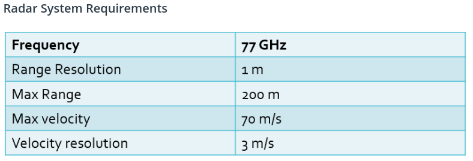
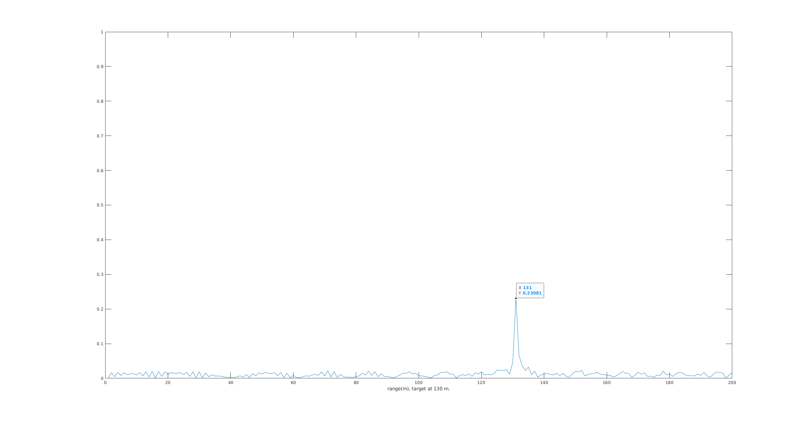
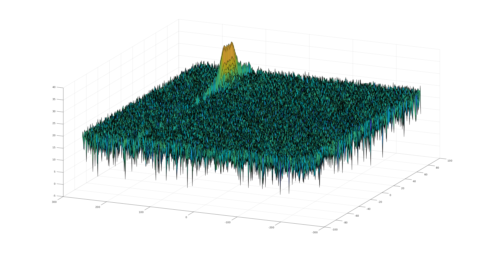
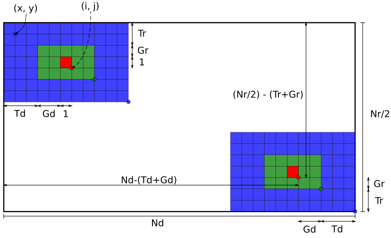
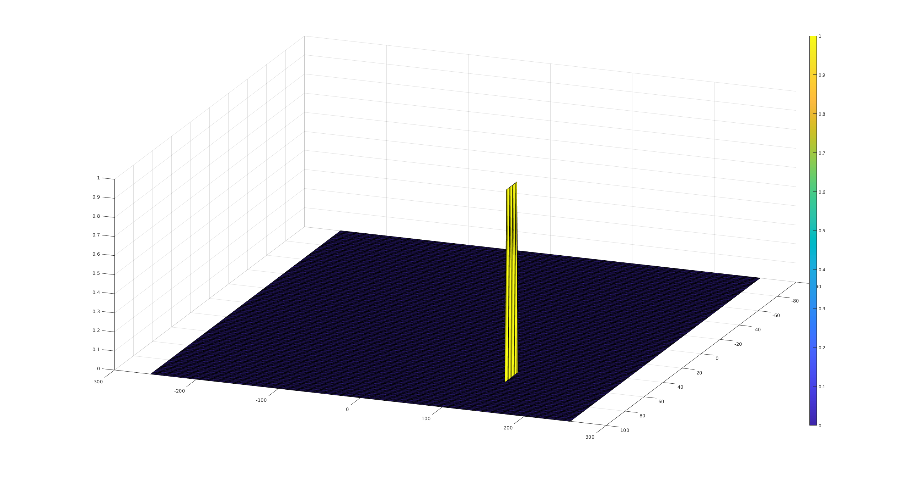

# Radar Target Generation and Detection
## FMCW Waveform Design
From giveb Radar system requirements, we can calculate `Chirp Bandwidth (Bchirp)`, `Chirp Time (Tchirp)`, and `Chirp Slope (Schirp)`.
|  | 
|:--:| 
| *Given Radar System Requirements* |

### Chirp Bandwidth (Bchirp)
Chirp bandwidth can be calculate using the following equation

### Chirp Time (Tchirp)
Chirp Time can be calculate using formular as follow,

where  is times of round trip time, and should be in range from 5 to 6. Using  of 5.5 we can calculate  as,

### Chirp Slope (Schirp)
Chirp slope is basically a ratio between  and  using values calculated above we got

## Simulation Loop
For this simulation, I choose target position to be at 130 m. away and moving at constant speed of 60 m/s. both within range of the Radar system requirements.

Position of the target overtime can simply calculate using linear motion equation.

We can then calculate a time-delay cause by changing position of the target

Transmit and Received signal can be model as 

and

Finally, calculate Beat signal using element-wise multiplication between Transmit and Receive signal

## Range FFT (1st FFT)
After BeatSignal has been simulated from above step, we can then apply Fast Fourier Transform on the signal. Output plot is shown below,

|  | 
|:--:| 
| *Actual target position is 130 m.* |

As can be seen, peak of the BeatSignal after FFT is at 131 m. while given target position at 130 m.

## 2D CFAR
Output of the signal after 2D FFT shown here,

|  | 
|:--:| 
| *Output of 2D FFT operation* |

Implement 2D CFAR is pretty much the same as 1D CFAR with a bit little bit more details on cells indexing. I am using a topology shown here to design both my inner/outter loop in order to calculate noise level.

|  | 
|:--:| 
| *2D CFAR cells (image is not to scale)* |

### Train cell and Guard cell size
For Train cell choose:
- Tr = 10
- Td = 8

And for Guard cell:
- Gr = 5
- Gd = 5

### Loop design
From information above, we can now determine start/end position of both inner and outter loop

First, for outter loop. We want to move a position of CUT cell throughout the map, `CUT cell position (i, j)` start from ((Tr+Gr+1), (Td+Gd+1)) and end at ((Nr/2 - (Tr+Gr)),(Nd - (Td+Gd))). The end position is shown in the picture above for clarity.

Lastly, for inner loop. We want to go through all the training cell to get noise level of each cell in order to calculate a threshold value. `Position of training cell (x, y)` is relative to CUT cell position (i, j). The training cell position start from ((i - (Tr+Gr)),(j - (Td+Gd))) and end at ((i + (Tr+Gr)),(j + (Td+Gd))). At the same time, we also need to check if the cell position fell into Guard area.

After each inner loop done, we can calculate theshold level and determine if CUT cell is signal/noise.

### Noise suppression
Since there are a few area in the map that won't get process by CFAR, Train areas on 4 side of the map. We will need so suppress those cell to have a value of 0.

The result of 2D CFAR is as follow

### Final output
|  | 
|:--:| 
| *2D CFAR Output* |
